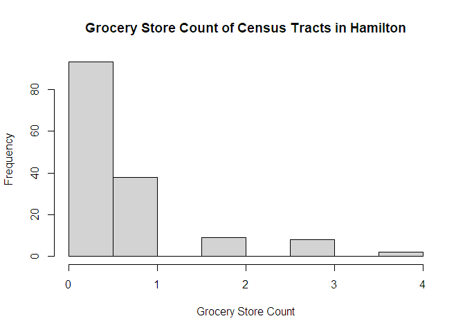

<!-- README.md is generated from README.Rmd. Please edit that file -->

# geog712package

<!-- badges: start -->
<!-- badges: end -->

This package is an activity completed by [Zehui
Yin](https://zehuiyin.github.io/) for the course [GEOG 712 Reproducible
Research Workflow with GitHub and
R](https://academiccalendars.romcmaster.ca/preview_course.php?catoid=55&coid=274877),
taught by [Dr. Antonio Paez](https://experts.mcmaster.ca/display/paezha)
in Fall 2024.

## Installation

You can install the development version of geog712package from
[GitHub](https://github.com) with:

``` r
if(!require(remotes)){
    install.packages("remotes")
    library(remotes)
}
remotes::install_github("zehuiyin/geog712package")
```

## Example

This is a basic example which shows you how to solve a common problem:

``` r
library(geog712package)
```

A simple multiplier function multiple two values.

``` r
multiplier(2, 3)
#> [1] 6
```

Load and plot the `grocery_CT` vector data. This dataset includes the
geometry of all the census tracts in Hamilton and contains a variable
that shows the count of grocery stores in each census tract.

``` r
data("grocery_DA")
hist(grocery_DA$Freq,
     main = "Grocery Store Count of Census Dissemination Area in Hamilton",
     xlab = "Grocery Store Count")
```



# How to cite

Yin, Z. (2024). geog712package: GEOG 712 R Package Activity.
<https://github.com/zehuiyin/geog712package>

``` latex
@Manual{geog712package,
  title = {geog712package: GEOG 712 R Package Activity},
  author = {Zehui Yin},
  year = {2024},
  note = {R package version 0.1.1},
  url = {https://github.com/zehuiyin/geog712package}
}
```
