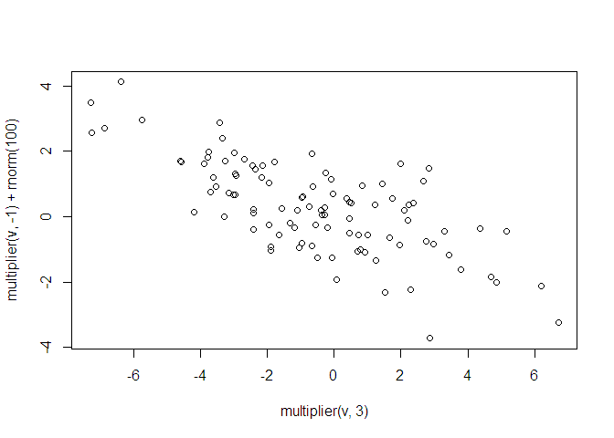

<!-- README.md is generated from README.Rmd. Please edit that file -->

# geog712package

<!-- badges: start -->
<!-- badges: end -->

This package is an activity completed by [Zehui
Yin](https://zehuiyin.github.io/) for the course [GEOG 712 Reproducible
Research Workflow with GitHub and
R](https://academiccalendars.romcmaster.ca/preview_course.php?catoid=55&coid=274877),
taught by [Dr. Antonio Paez](https://experts.mcmaster.ca/display/paezha)
in Fall 2024.

## Installation

You can install the development version of geog712package from
[GitHub](https://github.com) with:

``` r
if(!require(remotes)){
    install.packages("remotes")
    library(remotes)
}
remotes::install_github("zehuiyin/geog712package")
```

## Example

This is a basic example which shows you how to solve a common problem:

``` r
library(geog712package)
```

What is special about using `README.Rmd` instead of just `README.md`?
You can include R chunks like so:

``` r
multiplier(2, 3)
#> [1] 6
```

You’ll still need to render `README.Rmd` regularly, to keep `README.md`
up-to-date. `devtools::build_readme()` is handy for this.

You can also embed plots, for example:



In that case, don’t forget to commit and push the resulting figure
files, so they display on GitHub and CRAN.
